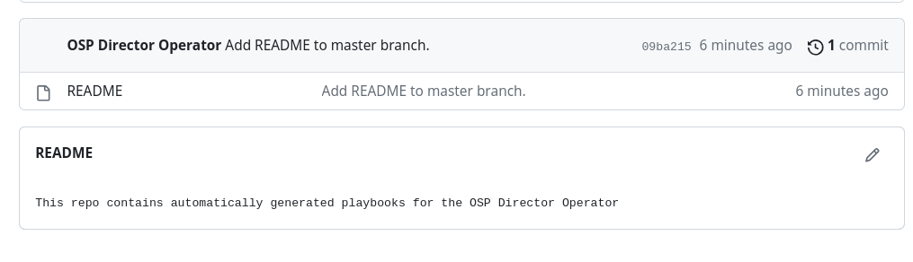
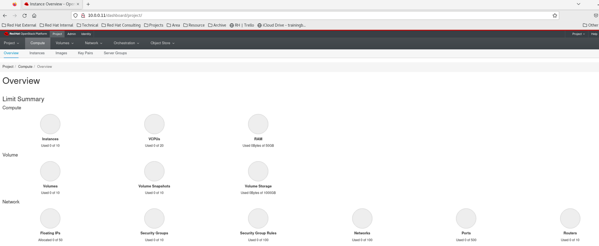
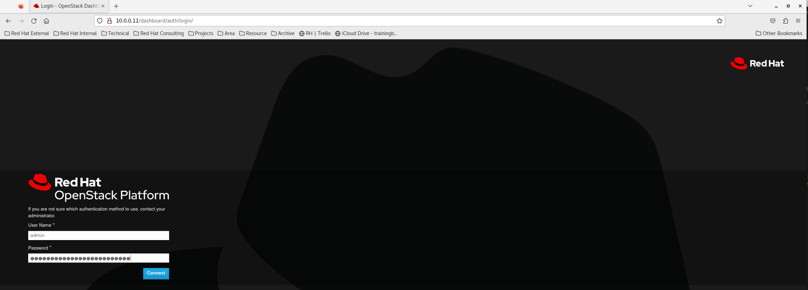

# Tutorial for OpenStack on Openshift; Deploying an overcloud in OCP with Openstack Director Operator (OSPdO)

> **WARNING**: The work exposed here is not supported in any way by Red Hat, this is the result of exploratory work. The information shared is solely for educational and informational purposes.

## TL;DL:

This tutorial aims to provide an OpenStack deployment procedure using the OpenStack director operator on OpenShift, utilizing minimal OpenStack templates and steps. The tutorial is based on OpenStack 17.1.

Here are some key points that I believe will help you prepare your environment:

- The `provisioningNetwork` must be set to `Managed`, preventing the use of the SNO cluster.
- The `provisioningNetwork` requires a dedicated network for `Baremetal` nodes. This network is separate from the OSP `control plane`.  
- Dynamic provisioning is assumed in this tutorial, with ODF configured. Alternatively, [NFS](https://access.redhat.com/documentation/en-us/red_hat_enterprise_linux/8/html/managing_file_systems/mounting-nfs-shares_managing-file-systems) can also be used.

## Installing and Preparing the Director Operator

Follow the official [prerequistes](https://access.redhat.com/documentation/en-us/red_hat_openstack_platform/17.1/html-single/deploying_an_overcloud_in_a_red_hat_openshift_container_platform_cluster_with_director_operator/index#prerequisites) and ensure that the cluster contains:

- A `bare-metal` cluster operator.
- OpenShift Virtualization Operator.
- SR-IOV Operator.
- Kubernetes NMState Operator. Be sure to create an NMState instance.
- A remote Git repository for OSPdO to store the generated configuration.

## Installing Director Operator
The first step is to install OSPdO. Follow [Chapter 2.3](https://access.redhat.com/documentation/en-us/red_hat_openstack_platform/17.1/html-single/deploying_an_overcloud_in_a_red_hat_openshift_container_platform_cluster_with_director_operator/index#proc_installing-director-operator_installing-OSPdO) to obtain the necessary images and push them to your own registry.

~~~shell
$ podman login registry.redhat.io
Username: {REGISTRY-SERVICE-ACCOUNT-USERNAME}
Password: {REGISTRY-SERVICE-ACCOUNT-PASSWORD}
Login Succeeded!

$ podman pull registry.redhat.io/rhosp-rhel8/osp-director-operator:1.3.0-9
~~~

Next, obtain the Operator Package Manager (opm) from [console.redhat.com](https://console.redhat.com/openshift/downloads.).

### Creating an Index Image with opm Tool:
Use the `opm` tool to create an index image:

~~~shell
BUNDLE_IMG="registry.redhat.io/rhosp-rhel9/osp-director-operator-bundle:1.3.1"
INDEX_IMG="quay.io/<account>/osp-director-operator-index:x.y.z-a"
opm index add --bundles ${BUNDLE_IMG} --tag ${INDEX_IMG} -u podman --pull-tool podman
~~~

After creating the index image, apply the following YAML to install OSPdO on the cluster:

~~~shell
$ oc apply -f 01-osp-director-operator.yaml

$ oc get operators
NAME                                                      AGE
osp-director-operator.openstack                           12d
~~~

## CrCreating a Data Volume for the base Operating System
Follow Chapter 2.4, and you can use the provided script `02-uploadimg.sh`. After successfully completing this step, a `Persistent Volume Claim` (PVC) should be created.

## Authentication Details for Git Repo
`OSPdO` stores rendered Ansible playbooks, which are generated by `15-openstack-config-generator.yaml`. Update `03-git-secret.sh` accordingly to include authentication details for the Git repository.

~~~shell
$ ./03-git-secret.sh
~~~

## Setting Root Password for Nodes
This step involves creating a `Secret` that will be referenced by `OpenStackControlPlane` and `OpenStackBaremetalSet` later.

~~~shell
$ ./04-openstack-userpassword.yaml
~~~

## Setting up Provisioning Server
Before proceeding to create the `OpenStackNetwork`, set up the `provisioning` server for the deployment of `Baremetal` nodes. `Metal3` will perform `introspection` on the compute nodes.

### Setup Metal3
Ensure that the `provisioning` server is configured appropriately to support Baremetal node deployment, as `Metal3` will rely on it for introspection processes.

~~~shell
$ oc apply -f 05-metal3-provisioning.yaml 
provisioning.metal3.io/provisioning-configuration created

$ oc get pod -n openshift-machine-api
NAME                                                 READY   STATUS    RESTARTS   AGE
cluster-autoscaler-operator-779cfbf6bd-ccmvv         2/2     Running   0          44h
cluster-baremetal-operator-f7d7ccb77-dm7m2           2/2     Running   0          44h
control-plane-machine-set-operator-9b5d5f975-pcwlg   1/1     Running   0          44h
machine-api-controllers-c9969d888-rvkx9              7/7     Running   0          44h
machine-api-operator-574fb448fd-5mrqw                2/2     Running   0          44h
metal3-78674c457f-jk2xg                              6/6     Running   0          102s
metal3-baremetal-operator-65f9fdd6f4-7hwgl           1/1     Running   0          101s
metal3-image-customization-784c46f877-hzhr2          1/1     Running   0          99s
~~~
Wait until the Metal3 container finds its IP address.

 
### Creating a Provisioning Server
Before deploying `baremetal` hosts, which will serve as our compute nodes, the `provisioning` server needs to be up and waiting for PXE requests on the `provisioning` network.

~~~shell
$ oc apply -f 06-openstack-provision.yaml 
openstackprovisionserver.osp-director.openstack.org/openstack-provision-server created

$ oc get openstackprovisionserver/openstack-provision-server -n openstack 
NAME                         STATUS        REASON
openstack-provision-server   Provisioned   OpenStackProvisionServer has been provisioned
~~~

## Adding Baremetal Host to Metal3 Inventory

As described in Chapter [2.2](https://access.redhat.com/documentation/en-us/red_hat_openstack_platform/17.1/html-single/deploying_an_overcloud_in_a_red_hat_openshift_container_platform_cluster_with_director_operator/index#con_baremetal-cluster-operators_installing-OSPdO), `Metal3` manages `baremetal` hosts. The following steps will create a `baremetal` host and trigger `Metal3` inspection.

In this tutorial, the compute node is a virtual machine (VM) running `Sushy` on KVM.

~~~shell
$ oc apply -f 07-bmh-compute.yaml 
secret/openstack-compute-bmc-secret created
baremetalhost.metal3.io/openstack-compute created
~~~
Verify pxe booting from the provisioning network. 

## Creating an Overcloud Network
This step involves creating two Linux bridges on worker nodes where Controller VMs reside.

> **NOTE**: 'br-ex' is already in use by OCP. Use a different name for the external network bridge. 

~~~shell
$ oc apply -f 08-openstacknetconfig_isolation.yaml

$ oc get OpenStackNetConfig
NAME                 ATTACHCONFIG DESIRED   ATTACHCONFIG READY   NETWORKS DESIRED   NETWORKS READY   PHYSNETWORKS DESIRED   PHYSNETWORKS READY   STATUS       REASON
openstacknetconfig   2                      2                    6                  6                1                      1                    Configured   OpenStackNetConfig openstacknetconfig all resources configured
$ oc get nncp
NAME        STATUS      REASON
br-osp      Available   SuccessfullyConfigured
br-osp-ex   Available   SuccessfullyConfigured
~~~

~~~shell
[core@worker1 ~]$ ip -br a | grep br
br-ex            UNKNOWN        172.16.100.103/16 169.254.169.2/29 
br-int           DOWN           
br-osp           UP             
br-osp-ex        UP      
~~~

## Creating a Control Plane 
Finally, we will observe the deployment of three Controller VMs on OCP.

~~~shell
$ oc apply -f 09-openstack-controller.yaml 
openstackcontrolplane.osp-director.openstack.org/overcloud created
$ oc get pod
NAME                                                              READY   STATUS      RESTARTS      AGE
2105cf1dd383981c8e40f5545396e7cf74cc8c76f59f34c0ecb1bbc05bpv46g   0/1     Completed   0             11d
openstack-provision-server-c86449547-t9nb9                        2/2     Running     1 (13m ago)   17m
openstackclient                                                   1/1     Running     0             3m35s
osp-director-operator-controller-manager-78bfb8d494-4482b         2/2     Running     1 (11d ago)   11d
osp-director-operator-index-6ncpr                                 1/1     Running     0             11d
virt-launcher-controller-0-wmmcr                                  1/1     Running     0             3m31s
virt-launcher-controller-1-qvdrp                                  1/1     Running     0             3m21s
virt-launcher-controller-2-zlhqc                                  1/1     Running     0             3m29s

~~~

## Creating Compute Nodes
In this tutorial, we have one compute node. This step involves installing RHOS on the compute node. Monitor the progress of the `Baremetal Host`.

~~~shell
$ oc apply -f 10-openstack-compute.yaml 
openstackbaremetalset.osp-director.openstack.org/compute created
~~~

## Registering Nodes with Subscription Manager

For controllers, you can utilize the Ansible playbook available in the `OpenStackClient` pod.

~~~shell
$ oc rsh -n openstack openstackclient
sh-5.1$ cd /home/cloud-admin/
sh-5.1$ ls
ctlplane-ansible-inventory  lost+found	tripleo-deploy	work
sh-5.1$ vi rhsm.yaml
sh-5.1$ ls
ctlplane-ansible-inventory  lost+found	rhsm.yaml  tripleo-deploy  work
sh-5.1$ ansible-playbook -i /home/cloud-admin/ctlplane-ansible-inventory ./rhsm.yaml
PLAY [Register Controller nodes] *********************************************************************************************************************************************************************************************************************************************************

TASK [Gathering Facts] *******************************************************************************************************************************************************************************************************************************************************************
ok: [172.22.0.13]
ok: [172.22.0.14]
ok: [172.22.0.12]

TASK [Register system] *******************************************************************************************************************************************************************************************************************************************************************
changed: [172.22.0.13]
changed: [172.22.0.14]
changed: [172.22.0.12]

TASK [Disable all repos] *****************************************************************************************************************************************************************************************************************************************************************
changed: [172.22.0.14]
changed: [172.22.0.12]
changed: [172.22.0.13]

TASK [Enable Controller node repos] ******************************************************************************************************************************************************************************************************************************************************
changed: [172.22.0.13] => (item=rhel-9-for-x86_64-baseos-eus-rpms)
changed: [172.22.0.12] => (item=rhel-9-for-x86_64-baseos-eus-rpms)
changed: [172.22.0.14] => (item=rhel-9-for-x86_64-baseos-eus-rpms)
changed: [172.22.0.13] => (item=rhel-9-for-x86_64-appstream-eus-rpms)
changed: [172.22.0.12] => (item=rhel-9-for-x86_64-appstream-eus-rpms)
changed: [172.22.0.14] => (item=rhel-9-for-x86_64-appstream-eus-rpms)
changed: [172.22.0.12] => (item=rhel-9-for-x86_64-highavailability-eus-rpms)
changed: [172.22.0.13] => (item=rhel-9-for-x86_64-highavailability-eus-rpms)
changed: [172.22.0.14] => (item=rhel-9-for-x86_64-highavailability-eus-rpms)
changed: [172.22.0.12] => (item=openstack-17.1-for-rhel-9-x86_64-rpms)
changed: [172.22.0.13] => (item=openstack-17.1-for-rhel-9-x86_64-rpms)
changed: [172.22.0.14] => (item=openstack-17.1-for-rhel-9-x86_64-rpms)
changed: [172.22.0.12] => (item=fast-datapath-for-rhel-9-x86_64-rpms)
changed: [172.22.0.14] => (item=fast-datapath-for-rhel-9-x86_64-rpms)
changed: [172.22.0.13] => (item=fast-datapath-for-rhel-9-x86_64-rpms)
changed: [172.22.0.12] => (item=rhceph-6-tools-for-rhel-9-x86_64-rpms)
changed: [172.22.0.14] => (item=rhceph-6-tools-for-rhel-9-x86_64-rpms)
changed: [172.22.0.13] => (item=rhceph-6-tools-for-rhel-9-x86_64-rpms)

PLAY RECAP *******************************************************************************************************************************************************************************************************************************************************************************
172.22.0.12                : ok=4    changed=3    unreachable=0    failed=0    skipped=0    rescued=0    ignored=0   
172.22.0.13                : ok=4    changed=3    unreachable=0    failed=0    skipped=0    rescued=0    ignored=0   
172.22.0.14                : ok=4    changed=3    unreachable=0    failed=0    skipped=0    rescued=0    ignored=0   

~~~

Resitger compute nodes with `subscription-manager`.

~~~shell
$ subscription-manager register
$ subscription-manager repos --disable *
$ subscription-manager repos --enable rhel-9-for-x86_64-baseos-eus-rpms
$ subscription-manager repos --enable rhel-9-for-x86_64-appstream-eus-rpms
$ subscription-manager repos --enable rhel-9-for-x86_64-highavailability-eus-rpms
$ subscription-manager repos --enable openstack-17.1-for-rhel-9-x86_64-rpms
$ subscription-manager repos --enable fast-datapath-for-rhel-9-x86_64-rpms
$ subscription-manager repos --enable rhceph-6-tools-for-rhel-9-x86_64-rpms
$ subscription-manger release --set=9.2
~~~

## Preparing the Overcloud Templates and Environment Files
For the purpose of this tutorial, we utilize a bare minimum set of files. All files are injected into the overcloud through a `ConfigMap`.

### Customized Templates

Jinja2 templates are employed to define NIC configuration templates. Locate the template in the OpenStackClient pod and customize it accordingly. Refer to this [step](https://access.redhat.com/documentation/en-us/red_hat_openstack_platform/17.1/html/installing_and_managing_red_hat_openstack_platform_with_director/assembly_configuring-overcloud-networking_installing-director-on-the-undercloud#proc_adding-a-composable-network_overcloud_networking) for guidance.

 ~~~shell
$ cd ./custom_templates
$ tar -cvzf custom-config.tar.gz disable_validations.yaml single_nic_vlans.j2
disable_validations.yaml
single_nic_vlans.j2
$ ./14-custom-configmap.sh 
configmap/tripleo-tarball-config created
~~~

### Customized Environment Files
The customized environment files will be included in the `heat-env-config ConfigMap`. Call the previous Jinja template with `ComputeNetworkConfigTemplate`. Also, update `ContainerImageRegistryCredentials` accordingly.

~~~shell
$ oc apply -f 11-heat-env-configmap.yaml 
configmap/heat-env-config created
~~~

## Creating Ansible Playbooks for Overcloud

The `OpenStackConfigGenerator` will generate the playbooks and push them to the Git repository.

~~~shell
$ oc apply -f 15-openstack-config-generator.yaml 
openstackconfiggenerator.osp-director.openstack.org/default created

$ oc logs -f default-jrxnh -n openstack
~~~

Verify the git has been updated.

## Deploying OpenStack

Create an `OpenStackDeploy` instance; OSPdO will generate a job that runs the Ansible playbooks, deploying the overcloud.

Retrieve the `hash/digest` of the latest `OpenStackConfigVersion` from the following step. Update the `16-openstack-deployment.yaml` with the hash/digest.

~~~shell
$ oc get -n openstack --sort-by {.metadata.creationTimestamp} openstackconfigversion -o json
~~~

~~~shell
$ oc create -f openstack-deployment.yaml -n openstack
$ oc get pod
NAME                                                              READY   STATUS      RESTARTS      AGE
2105cf1dd383981c8e40f5545396e7cf74cc8c76f59f34c0ecb1bbc05bpv46g   0/1     Completed   0             11d
deploy-openstack-default-6ntqv                                    1/1     Running     0             3m20s
openstack-provision-server-c86449547-t9nb9                        2/2     Running     1 (48m ago)   53m
openstackclient                                                   1/1     Running     0             39m
osp-director-operator-controller-manager-78bfb8d494-4482b         2/2     Running     1 (11d ago)   11d
osp-director-operator-index-6ncpr                                 1/1     Running     0             11d
virt-launcher-controller-0-wmmcr                                  1/1     Running     0             39m
virt-launcher-controller-1-qvdrp                                  1/1     Running     0             39m
virt-launcher-controller-2-zlhqc                                  1/1     Running     0             39m
$ oc logs -f deploy-openstack-default-6ntqv
~~~

After initiating the OpenStack deployment, wait for the process to complete.

~~~shell
2023-12-03 01:33:24.330121 | 0a580a82-0174-d3c7-9776-00000000a067 |    SUMMARY | controller-0 | Wait for puppet host configuration to finish | 31.07s
2023-12-03 01:33:24.330155 | ~~~~~~~~~~~~~~~~~~~~~~~~~~~~~~~~ End Summary Information ~~~~~~~~~~~~~~~~~~~~~~~~~~~~~~~~
sudo: unable to send audit message: Operation not permitted
sudo: unable to send audit message: Operation not permitted
sudo: unable to send audit message: Operation not permitted
I1203 01:33:04.325231       1 deploy.go:237] Running process Overcloud JSON.
I1203 01:33:04.504517       1 deploy.go:471] Shutting down deploy agent
~~~

## Accessing an Overcloud Deployed with OSPdO

Access the remote shell for the OpenStack client and run OpenStack commands.

~~~shell
$ oc rsh -n openstack openstackclient
Defaulted container "openstackclient" out of: openstackclient, init-0 (init)
sh-5.1$ cd /home/cloud-admin
sh-5.1$ openstack network create default
+---------------------------+--------------------------------------+
| Field                     | Value                                |
+---------------------------+--------------------------------------+
| admin_state_up            | UP                                   |
| availability_zone_hints   |                                      |
| availability_zones        |                                      |
| created_at                | 2023-12-02T00:13:09Z                 |
| description               |                                      |
| dns_domain                |                                      |
| id                        | 3a43e5f5-709d-4cc9-8e80-00b8463ce0ca |
| ipv4_address_scope        | None                                 |
| ipv6_address_scope        | None                                 |
| is_default                | False                                |
| is_vlan_transparent       | None                                 |
| mtu                       | 1442                                 |
| name                      | default                              |
| port_security_enabled     | True                                 |
| project_id                | 512d85d47fff46b6af8709ecd9952512     |
| provider:network_type     | geneve                               |
| provider:physical_network | None                                 |
| provider:segmentation_id  | 54119                                |
| qos_policy_id             | None                                 |
| revision_number           | 1                                    |
| router:external           | Internal                             |
| segments                  | None                                 |
| shared                    | False                                |
| status                    | ACTIVE                               |
| subnets                   |                                      |
| tags                      |                                      |
| updated_at                | 2023-12-02T00:13:09Z                 |
+---------------------------+--------------------------------------+
sh-5.1$ openstack endpoint list
+----------------------------------+-----------+--------------+----------------+---------+-----------+-----------------------------------------------+
| ID                               | Region    | Service Name | Service Type   | Enabled | Interface | URL                                           |
+----------------------------------+-----------+--------------+----------------+---------+-----------+-----------------------------------------------+
| 0582141acdd04637bd2501d2d2374a93 | regionOne | swift        | object-store   | True    | public    | http://10.0.0.10:8080/v1/AUTH_%(tenant_id)s   |
| 0c482a1a94fb4db2a88ee04635ba519e | regionOne | neutron      | network        | True    | public    | http://10.0.0.10:9696                         |
| 0f95a805ce5e433396ca9ef744aeaae7 | regionOne | heat         | orchestration  | True    | internal  | http://172.17.0.10:8004/v1/%(tenant_id)s      |
| 17b14189acca4339bbd978e91f87d8b3 | regionOne | heat-cfn     | cloudformation | True    | public    | http://10.0.0.10:8000/v1                      |
| 326ce42688c045b8b3a1c968ec1d2955 | regionOne | glance       | image          | True    | admin     | http://172.17.0.10:9293                       |
| 3a78eeec625c4824bdf8262d873a7cd4 | regionOne | swift        | object-store   | True    | internal  | http://172.18.0.10:8080/v1/AUTH_%(tenant_id)s |
| 4b112be67fe24559869205df8f2fd987 | regionOne | nova         | compute        | True    | admin     | http://172.17.0.10:8774/v2.1                  |
| 4c84d17161e24ecbbb8eb9da44b2e3f0 | regionOne | glance       | image          | True    | internal  | http://172.17.0.10:9293                       |
| 7b4034e664be4c37b439b577bd495a63 | regionOne | nova         | compute        | True    | internal  | http://172.17.0.10:8774/v2.1                  |
| 7db0d6f619ba40e4b1e3811691e3e337 | regionOne | cinderv3     | volumev3       | True    | public    | http://10.0.0.10:8776/v3/%(tenant_id)s        |
| 87eeba50f25447049721b3cf8ce28a9d | regionOne | swift        | object-store   | True    | admin     | http://172.18.0.10:8080                       |
| 9032fc2b1f6b42b4b8656a4bae0fb996 | regionOne | keystone     | identity       | True    | internal  | http://172.17.0.10:5000                       |
| a6413fe8ec004a208964f5320cd2b49b | regionOne | neutron      | network        | True    | admin     | http://172.17.0.10:9696                       |
| ac4f60b4336444c18f2b6fdcee1e0594 | regionOne | placement    | placement      | True    | admin     | http://172.17.0.10:8778/placement             |
| acef69a3f18643d7a41365daf34242d6 | regionOne | heat         | orchestration  | True    | admin     | http://172.17.0.10:8004/v1/%(tenant_id)s      |
| b17e9ae7dd76435093ddd079d2e5d9c9 | regionOne | placement    | placement      | True    | public    | http://10.0.0.10:8778/placement               |
| bb4023a50e2a4277a3f537e7942e4f3b | regionOne | keystone     | identity       | True    | public    | http://10.0.0.10:5000                         |
| c29e687433a048f5b167803e1ce3d289 | regionOne | heat-cfn     | cloudformation | True    | internal  | http://172.17.0.10:8000/v1                    |
| c35ee452fa0a4c56a717005a7a3e3542 | regionOne | nova         | compute        | True    | public    | http://10.0.0.10:8774/v2.1                    |
| c50ac8afcdce4f499af03741f033f2f3 | regionOne | cinderv3     | volumev3       | True    | internal  | http://172.17.0.10:8776/v3/%(tenant_id)s      |
| c75304d075774bb7a1adf5a42cfd4359 | regionOne | cinderv3     | volumev3       | True    | admin     | http://172.17.0.10:8776/v3/%(tenant_id)s      |
| d4a2df19debe4864913e15b23f129d14 | regionOne | keystone     | identity       | True    | admin     | http://172.22.0.10:35357                      |
| de91b3956fa242b6833e1776cfe47a6a | regionOne | neutron      | network        | True    | internal  | http://172.17.0.10:9696                       |
| e0641023a27e403d8ed62370a4832724 | regionOne | glance       | image          | True    | public    | http://10.0.0.10:9292                         |
| e53132d1d977402383c0de239b32b7ca | regionOne | placement    | placement      | True    | internal  | http://172.17.0.10:8778/placement             |
| f764eadbe6fb4bf5a17594b2a5e105ea | regionOne | heat-cfn     | cloudformation | True    | admin     | http://172.17.0.10:8000/v1                    |
| f7ad6e062b234262bd6d4745f31d324f | regionOne | heat         | orchestration  | True    | public    | http://10.0.0.10:8004/v1/%(tenant_id)s        |
+----------------------------------+-----------+--------------+----------------+---------+-----------+-----------------------------------------------+
~~~

Retrieve the `admin` password from the `tripleo-passwords` secret and use it to log in to the `Horizon` GUI.

~~~shell
$ oc get secret tripleo-passwords -o jsonpath='{.data.tripleo-overcloud-passwords\.yaml}' | base64 -d

--- ommit
parameter_defaults:
  AdminPassword: lht4mbvzj6g6sflcltjpg7tl2
  AdminToken: lklsnm2c995s7fnzmlvxz5h9f
  AodhPassword: 84xm5jv9tdqdd6xxx8x4kqqfb
  BarbicanPassword: h966z2r9v8v8cvsmvdb7zt4p2
~~~

Retrieve the external address from the `OpenStackNetConfig` CR.

~~~shell
    controlplane:
      ipaddresses:
        ctlplane: 172.22.0.10/24
        external: 10.0.0.11/24
        internal_api: 172.17.0.10/24
        storage: 172.18.0.10/24
        storage_mgmt: 172.19.0.10/24
      ovnBridgeMacAdresses: {}
~~~

Now, you should see the GUI.

