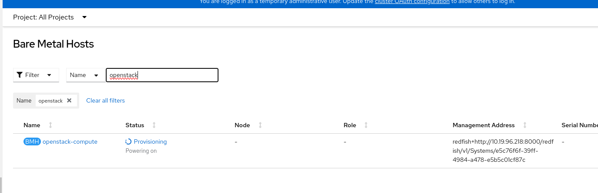

# Tutorial for OpenStack on Openshift; Deploying an overcloud in OCP with Openstack Director Operator (OSPdO)

> **WARNING**: The work exposed here is not supported in any way by Red Hat, this is the result of exploratory work. The information shared is solely for educational and informational purposes.

## TL:DL

- `provisioningNetwork` has to be set `Managaged`, so SNO cluster cannot be used. 
- `provisioningNetwork` has dedicate network for Baremetal node, this is seprate nework from OSP `controlplane`.  
- Dynamic provisioning is assumed. ODF is configured in this tutorial. Alternatively, [NFS](https://access.redhat.com/documentation/en-us/red_hat_enterprise_linux/8/html/managing_file_systems/mounting-nfs-shares_managing-file-systems) also can be used. 

## Installing and preparing director Operator

1. Follow the offical step, make sure the cluster contains:

- A `baremetal` cluster operator
- OpenShift Virtualization Operator
- SR-IOV Operator 
- Kubernetes NMState Operator. Make sure to create an NMState instance.  
- A remote Git repository for OSPdO to store the generated configuration

## Installing director Operator
First step is to install OSPdO.

Follow [chapter 2.3](https://access.redhat.com/documentation/en-us/red_hat_openstack_platform/17.1/html-single/deploying_an_overcloud_in_a_red_hat_openshift_container_platform_cluster_with_director_operator/index#proc_installing-director-operator_installing-OSPdO) to obtain images and push it to your own registry. 

~~~shell
$ podman login registry.redhat.io
Username: {REGISTRY-SERVICE-ACCOUNT-USERNAME}
Password: {REGISTRY-SERVICE-ACCOUNT-PASSWORD}
Login Succeeded!

$ podman pull registry.redhat.io/rhosp-rhel8/osp-director-operator:1.3.0-9
~~~

Obtain the Operator Package Manager (opm) from [console.redhat.com](https://console.redhat.com/openshift/downloads.)

Then, use the `opm` tool to creat an index image:

~~~shell
BUNDLE_IMG="registry.redhat.io/rhosp-rhel9/osp-director-operator-bundle:1.3.1"
INDEX_IMG="quay.io/<account>/osp-director-operator-index:x.y.z-a"
opm index add --bundles ${BUNDLE_IMG} --tag ${INDEX_IMG} -u podman --pull-tool podman
~~~

Apply the following yaml to install OSPdO to the cluster.

~~~shell
$ oc apply -f 01-osp-director-operator.yaml

$ oc get operators
NAME                                                      AGE
osp-director-operator.openstack                           12d
~~~

## Creating a data volume for the base operating system
Follow chapter 2.4. you can use `02-uploadimg.sh` can be used. 
After sussful this step, `PVC` should be created.

## Authenticaion details for Git repo
OSPdO stores rendered Ansible playbooks which will be generated by `15-openstack-config-generator.yaml`. Update `03-git-secreat.sh` accodingly. 

~~~shell
$ ./03-git-secret.sh
~~~

## Setting root password for nodes
This step creates `Secret` that will be refered by `OpenStackControlPlane` and `OpenStackBareemtalSet` later. 

~~~shell
$ ./04-openstack-userpassword.yaml
~~~

## Setup Provisoning Server 
Before moving on creating OpenstackNetwork, setup provioning server for Baremetal node deployment. 
Metal3 will `introspection` to the compute node. 

### Setup Metal3

~~~shell
$ oc apply -f 05-metal3-provisioning.yaml 
provisioning.metal3.io/provisioning-configuration created

$ oc get pod -n openshift-machine-api
NAME                                                 READY   STATUS    RESTARTS   AGE
cluster-autoscaler-operator-779cfbf6bd-ccmvv         2/2     Running   0          44h
cluster-baremetal-operator-f7d7ccb77-dm7m2           2/2     Running   0          44h
control-plane-machine-set-operator-9b5d5f975-pcwlg   1/1     Running   0          44h
machine-api-controllers-c9969d888-rvkx9              7/7     Running   0          44h
machine-api-operator-574fb448fd-5mrqw                2/2     Running   0          44h
metal3-78674c457f-jk2xg                              6/6     Running   0          102s
metal3-baremetal-operator-65f9fdd6f4-7hwgl           1/1     Running   0          101s
metal3-image-customization-784c46f877-hzhr2          1/1     Running   0          99s
~~~
Wait until the metal3 container finds its ip address.

 
### Create a provisioning server
Before deploy `baremetal` Host, which will be our compute node, provisoning server needs to be up and waiting for PXE request on the provisioning network.

~~~shell
$ oc apply -f 06-openstack-provision.yaml 
openstackprovisionserver.osp-director.openstack.org/openstack-provision-server created

$ oc get openstackprovisionserver/openstack-provision-server -n openstack 
NAME                         STATUS        REASON
openstack-provision-server   Provisioned   OpenStackProvisionServer has been provisioned
~~~

## Add Baremetal Host into metal3 inventory
As chapter [2.2](https://access.redhat.com/documentation/en-us/red_hat_openstack_platform/17.1/html-single/deploying_an_overcloud_in_a_red_hat_openshift_container_platform_cluster_with_director_operator/index#con_baremetal-cluster-operators_installing-OSPdO) described, `metal3` manages baremeatl hosts. 
The following step will create a `baremetal` hosts and trigger metal3 inspection.

In this tutorial, Compute node is a VM and runnign `sushy` on the KVM. 

~~~shell
$ oc apply -f 07-bmh-compute.yaml 
secret/openstack-compute-bmc-secret created
baremetalhost.metal3.io/openstack-compute created
~~~
Make sure it is pxe booting from the provisioning network. 

## Creating an overcloud network
This step will create two linux bridges in worker nodes where Controller VMs reside. 

> **NOTE**: 'br-ex' is already being used by OCP. Use different naming for external network.  

~~~shell
$ oc apply -f 08-openstacknetconfig_isolation.yaml

$ oc get OpenStackNetConfig
NAME                 ATTACHCONFIG DESIRED   ATTACHCONFIG READY   NETWORKS DESIRED   NETWORKS READY   PHYSNETWORKS DESIRED   PHYSNETWORKS READY   STATUS       REASON
openstacknetconfig   2                      2                    6                  6                1                      1                    Configured   OpenStackNetConfig openstacknetconfig all resources configured
$ oc get nncp
NAME        STATUS      REASON
br-osp      Available   SuccessfullyConfigured
br-osp-ex   Available   SuccessfullyConfigured
~~~

~~~shell
[core@worker1 ~]$ ip -br a | grep br
br-ex            UNKNOWN        172.16.100.103/16 169.254.169.2/29 
br-int           DOWN           
br-osp           UP             
br-osp-ex        UP      
~~~

## Creating a control plane 
Finaly we will see 3 Controller VMs on OCP.

~~~shell
$ oc apply -f 09-openstack-controller.yaml 
openstackcontrolplane.osp-director.openstack.org/overcloud created
$ oc get pod
NAME                                                              READY   STATUS      RESTARTS      AGE
2105cf1dd383981c8e40f5545396e7cf74cc8c76f59f34c0ecb1bbc05bpv46g   0/1     Completed   0             11d
openstack-provision-server-c86449547-t9nb9                        2/2     Running     1 (13m ago)   17m
openstackclient                                                   1/1     Running     0             3m35s
osp-director-operator-controller-manager-78bfb8d494-4482b         2/2     Running     1 (11d ago)   11d
osp-director-operator-index-6ncpr                                 1/1     Running     0             11d
virt-launcher-controller-0-wmmcr                                  1/1     Running     0             3m31s
virt-launcher-controller-1-qvdrp                                  1/1     Running     0             3m21s
virt-launcher-controller-2-zlhqc                                  1/1     Running     0             3m29s

~~~

## Creating Compute nodes
In this tutorial, we have one compute node. This step will install RHOS to the compute node.
Monitor the progress of `Baremetal Host`

~~~shell
$ oc apply -f 10-openstack-compute.yaml 
openstackbaremetalset.osp-director.openstack.org/compute created
~~~

## Register nodes with subscription manager 

For controller, we can use the ansible playbook in the `OpenStackClient` pod.

~~~shell
$ oc rsh -n openstack openstackclient
sh-5.1$ cd /home/cloud-admin/
sh-5.1$ ls
ctlplane-ansible-inventory  lost+found	tripleo-deploy	work
sh-5.1$ vi rhsm.yaml
sh-5.1$ ls
ctlplane-ansible-inventory  lost+found	rhsm.yaml  tripleo-deploy  work
sh-5.1$ ansible-playbook -i /home/cloud-admin/ctlplane-ansible-inventory ./rhsm.yaml
PLAY [Register Controller nodes] *********************************************************************************************************************************************************************************************************************************************************

TASK [Gathering Facts] *******************************************************************************************************************************************************************************************************************************************************************
ok: [172.22.0.13]
ok: [172.22.0.14]
ok: [172.22.0.12]

TASK [Register system] *******************************************************************************************************************************************************************************************************************************************************************
changed: [172.22.0.13]
changed: [172.22.0.14]
changed: [172.22.0.12]

TASK [Disable all repos] *****************************************************************************************************************************************************************************************************************************************************************
changed: [172.22.0.14]
changed: [172.22.0.12]
changed: [172.22.0.13]

TASK [Enable Controller node repos] ******************************************************************************************************************************************************************************************************************************************************
changed: [172.22.0.13] => (item=rhel-9-for-x86_64-baseos-eus-rpms)
changed: [172.22.0.12] => (item=rhel-9-for-x86_64-baseos-eus-rpms)
changed: [172.22.0.14] => (item=rhel-9-for-x86_64-baseos-eus-rpms)
changed: [172.22.0.13] => (item=rhel-9-for-x86_64-appstream-eus-rpms)
changed: [172.22.0.12] => (item=rhel-9-for-x86_64-appstream-eus-rpms)
changed: [172.22.0.14] => (item=rhel-9-for-x86_64-appstream-eus-rpms)
changed: [172.22.0.12] => (item=rhel-9-for-x86_64-highavailability-eus-rpms)
changed: [172.22.0.13] => (item=rhel-9-for-x86_64-highavailability-eus-rpms)
changed: [172.22.0.14] => (item=rhel-9-for-x86_64-highavailability-eus-rpms)
changed: [172.22.0.12] => (item=openstack-17.1-for-rhel-9-x86_64-rpms)
changed: [172.22.0.13] => (item=openstack-17.1-for-rhel-9-x86_64-rpms)
changed: [172.22.0.14] => (item=openstack-17.1-for-rhel-9-x86_64-rpms)
changed: [172.22.0.12] => (item=fast-datapath-for-rhel-9-x86_64-rpms)
changed: [172.22.0.14] => (item=fast-datapath-for-rhel-9-x86_64-rpms)
changed: [172.22.0.13] => (item=fast-datapath-for-rhel-9-x86_64-rpms)
changed: [172.22.0.12] => (item=rhceph-6-tools-for-rhel-9-x86_64-rpms)
changed: [172.22.0.14] => (item=rhceph-6-tools-for-rhel-9-x86_64-rpms)
changed: [172.22.0.13] => (item=rhceph-6-tools-for-rhel-9-x86_64-rpms)

PLAY RECAP *******************************************************************************************************************************************************************************************************************************************************************************
172.22.0.12                : ok=4    changed=3    unreachable=0    failed=0    skipped=0    rescued=0    ignored=0   
172.22.0.13                : ok=4    changed=3    unreachable=0    failed=0    skipped=0    rescued=0    ignored=0   
172.22.0.14                : ok=4    changed=3    unreachable=0    failed=0    skipped=0    rescued=0    ignored=0   

~~~

Resitger compute node with `subscription-manager`.

~~~shell
$ subscription-manager register
$ subscription-manager repos --disable *
$ subscription-manager repos --enable rhel-9-for-x86_64-baseos-eus-rpms
$ subscription-manager repos --enable rhel-9-for-x86_64-appstream-eus-rpms
$ subscription-manager repos --enable rhel-9-for-x86_64-highavailability-eus-rpms
$ subscription-manager repos --enable openstack-17.1-for-rhel-9-x86_64-rpms
$ subscription-manager repos --enable fast-datapath-for-rhel-9-x86_64-rpms
$ subscription-manager repos --enable rhceph-6-tools-for-rhel-9-x86_64-rpms
$ subscription-manger release --set=9.2
~~~

## Preparing the overcloud templates and environments files
For the purpose of this tutorial, we have a bare minimum of set of files.
All files are injected to the overvloud through `ConfigMap`.

### Customized templates
 Jinja2 templates are used to define NIC configuration templates. Find the template in the `OpenStackClient` pod, and customize accodingly. Refer to this [step](https://access.redhat.com/documentation/en-us/red_hat_openstack_platform/17.1/html/installing_and_managing_red_hat_openstack_platform_with_director/assembly_configuring-overcloud-networking_installing-director-on-the-undercloud#proc_adding-a-composable-network_overcloud_networking).

~~~shell
$ cd ./custom_templates
$ tar -cvzf custom-config.tar.gz disable_validations.yaml single_nic_vlans.j2
disable_validations.yaml
single_nic_vlans.j2
$ ./14-custom-configmap.sh 
configmap/tripleo-tarball-config created
~~~

#### Custmized environment files
The custom environment files will be carried in the `heat-env-config ConfigMap`.
We call the previous jinja template with `ComputeNetworkConfigTemplate`. Also, update `ContainerImageRegistryCredentials` accordingly. 

~~~shell
$ oc apply -f 11-heat-env-configmap.yaml 
configmap/heat-env-config created
~~~

